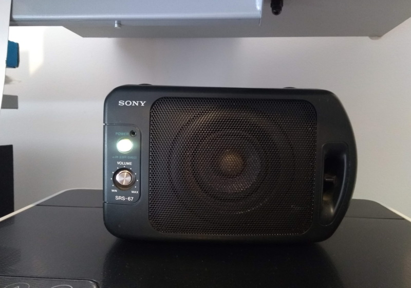
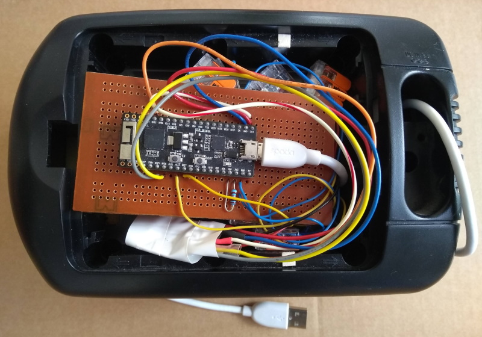

# Achtsamkeits-Glocke #

ESP32 connected to I2S audio breakout, see https://learn.sparkfun.com/tutorials/i2s-audio-breakout-hookup-guide

versions:
* 04-cfg - configuration inputs Volume / Sound
* 05-led - timer estimation based on LED duty cycle


```
         +---------------+
         |o    ANT      o|
         |o ___________ o|
         |o             o|
         |o             o|
         |o          D22o|- I2S
    I2S -|oD25          o|
    I2S -|oD26          o|
         |o          D18o|- Vol
    key -|oD33          o|
    led -|oD27       D10o|- Snd
         |o           D9o|- Snd
         |o             o|
         |o             o|
         |o             o|
         |o             o|
         |o             o|
  -4k7R--|oIO0          o|
  |------|o3V3          o|
         |oGND       GNDo|- breakout GND
         |o5V  |USB| 3V3o|- breakout VDD
         +-----+---+-----+
```


remarks:
* board: ESP32 pico kit
* note: 'partition scheme: no OTA' --> 1.3 Mbyte wav files in PROGMEM
* pull-up IO0 for power-up reset
* sound files based on samples from freesound https://freesound.org/ (with appropriate licenses)
* editing with https://www.audacityteam.org/
* conversion using sox http://sox.sourceforge.net/


usage:
* power (and optional commands) via usb
* runs silently for 60 min and plays sound (hardware selected)
* ⏸️ ☕ 🧘 __have a break__ 🧘 ☕ ⏸️ 
* push buttons 'key' starts new cycle of 60 min
* LED shows elapsed time via duty cycle


commands (via USB / serial interface):
```
BCGH    - sounds used
bdflpto - other sounds
0       - sound off
1..9    - volume
T       - show timer
s       - speed up timer
!       - Reset
?       - help
```
Bowl, Clock, _Gong_, Horn

bicycle bell, ding-dong, feedback, laser, power-up, tin, over



